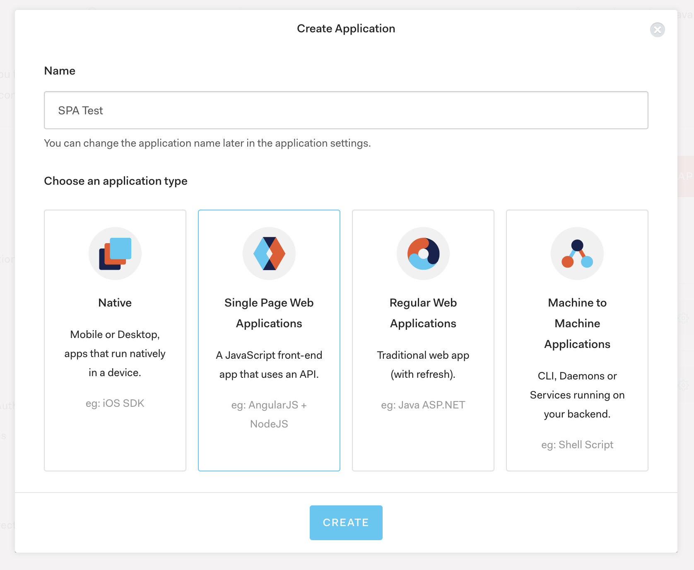
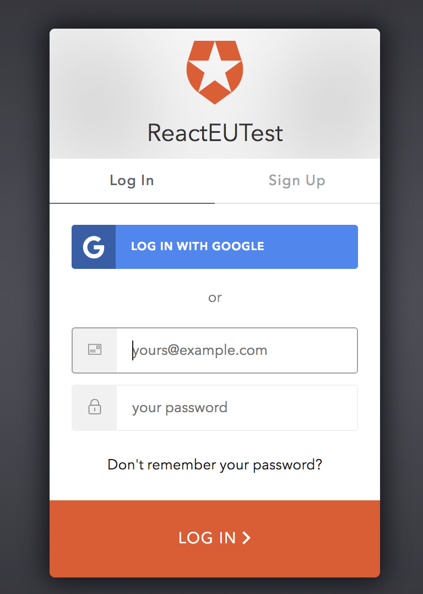

# Auth0 SPA

This project is a test exercise for [Auth0](https://auth0.com/) for a SPA using [React](https://reactjs.org/)

Requiments:
* node and npm
* [Auth0 account](https://auth0.com/)

Libraries (used on the project):
* [create react app](https://github.com/facebook/create-react-app#readme)
* [react router](https://reacttraining.com/react-router/web/guides/philosophy)
* [material ui](https://material-ui.com/)
* [auth0-js](https://github.com/auth0/auth0.js)

## Auth0 SPA Set up
Once you have an account, go to [Applications](https://manage.auth0.com/#/applications) section and create a new **Application**. \
Give a name to your application and select *Single Page Web Applications* and clicl on *Create*. \

This will create a new application, you can skip the previous step if you already have one application created. \

Next step is go to **Settings** tab, there we can get the keys to use in our application:
* Domain
* Client ID

In this section we also have to set up the *callback url*, where the client it is going to be redirected once the user login/signup in our application using auth0. \
For this step, scroll down to *Allowed Callback URLs* and set up the right value, in our demo case we will use ***http://localhost:3000/callback***.

We can also set up more than one value
```
http://localhost:3000/callback, http://10.0.71.166:3000/callback
```
We will set up this values in the **.env** file in our project.


## Project set up
We have to install the *auth0* library
```
# installation with npm
npm install --save auth0-js
```

On the *.env* we will set up the following values that we got from the Auth0 Application:
```
REACT_APP_NAME=Auth0 SPA
REACT_APP_DOMAIN=XXX.auth0.com
REACT_APP_CLIENT_ID=XXX
REACT_APP_ENDPOINT=XXX
REACT_APP_TOKEN_EXPIRATION=36000
```

## Authentication Controller
We have set up a controller to handle all the authentication flow.\
The object initializes the auth0 object with our app values.
```
import auth0 from "auth0-js";

...
class Auth {
  auth0 = new auth0.WebAuth({
    domain: AUTH_CONFIG.domain,
    clientID: AUTH_CONFIG.clientId,
    redirectUri: AUTH_CONFIG.callbackUrl,
    responseType: "token id_token",
    scope: "openid"
  })

  ...

  login() {
    this.auth0.authorize();
  }

  ...
}

const auth = new Auth();

export default auth;
```
Then we create an instance of the class and we export it so we can access to the object from different places in our app.

We use the localStorage to store the data of the user. Once the user logs out, we will clear this values.

## Handle login
In our application, we control the login and logout in the app bar. There we have set up a button that will allow the user to login.\
To login the user we have to user the *Authentication controller* we created.\
On the component, we use the login method:
```
  import { Auth } from "../../controllers";
  
  ...

  onLogin = () => {
    Auth.login();
  };

  ...
```
This action uses the auth0 library that will open our app screen in the domain of our app *https://XXX_YOUR_DOMAIN.auth0.com*


## Handle Callback from Auth0
Once the user logs in (or signs up), auth0 will redirect the user to the callback endpoint we defined when we initialize the auth0 instance.\
To handle the data, we have defined a *Callback* container that handles the callback. It uses the Auth Controller to set up the user data that auth0 sends to the client
```
const handleAuthentication = ({ location }) => {
  if (/access_token|id_token|error/.test(location.hash)) {
    Auth.handleAuthentication();
  }
};

const Callback = props => {
  handleAuthentication(props);

  return (
    <div style={STYLE}>
      
    </div>
  );
};
```
Once the controllers store the data in the localStorage, it will redirect the client to other route of our app, in this demo, we redirect to the dashboard page